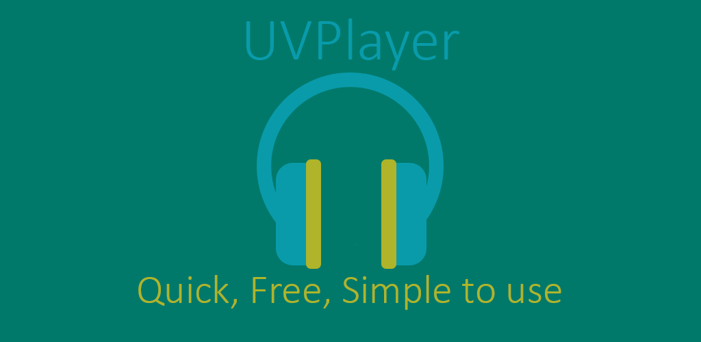
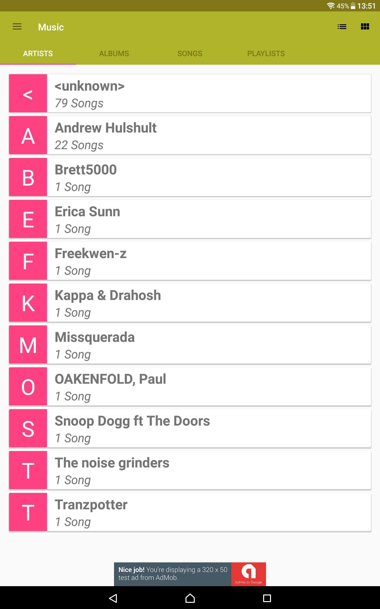
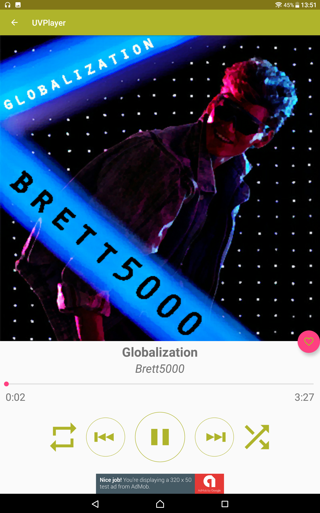
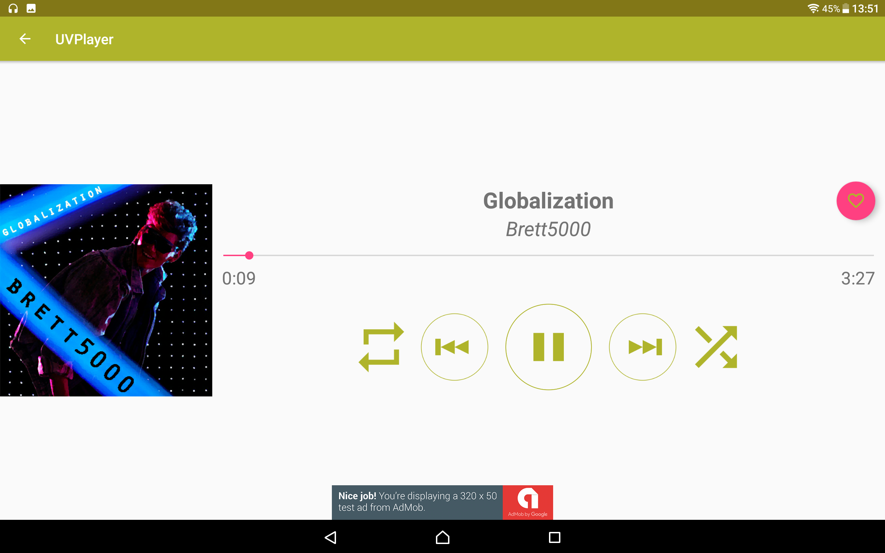
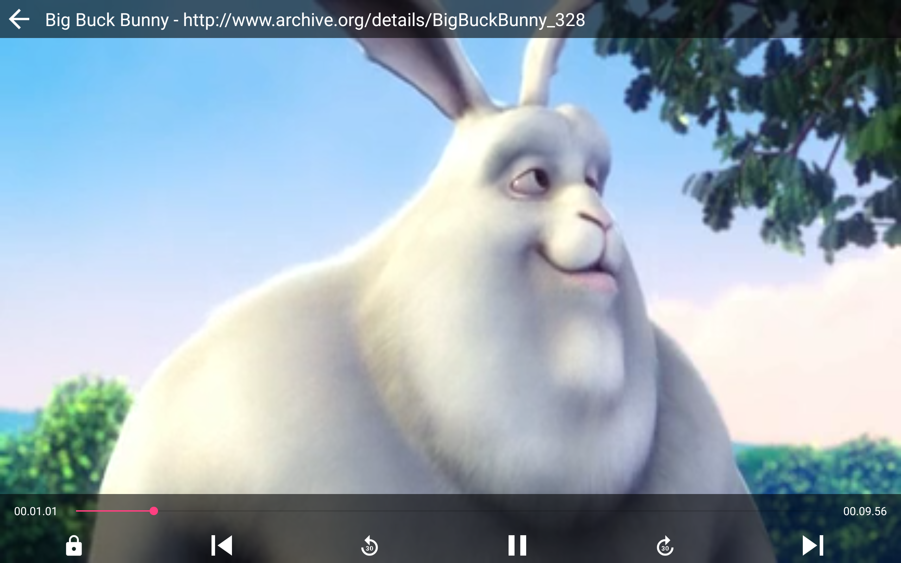
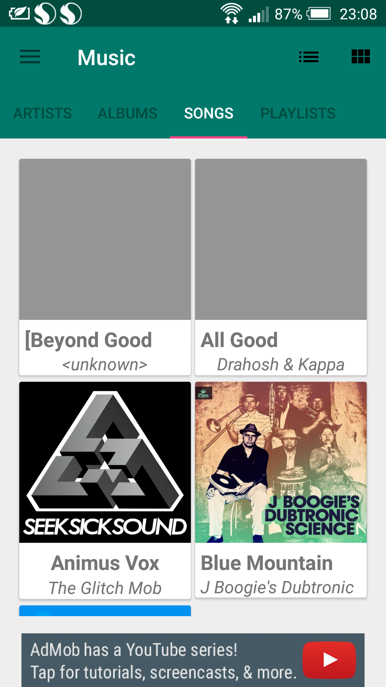
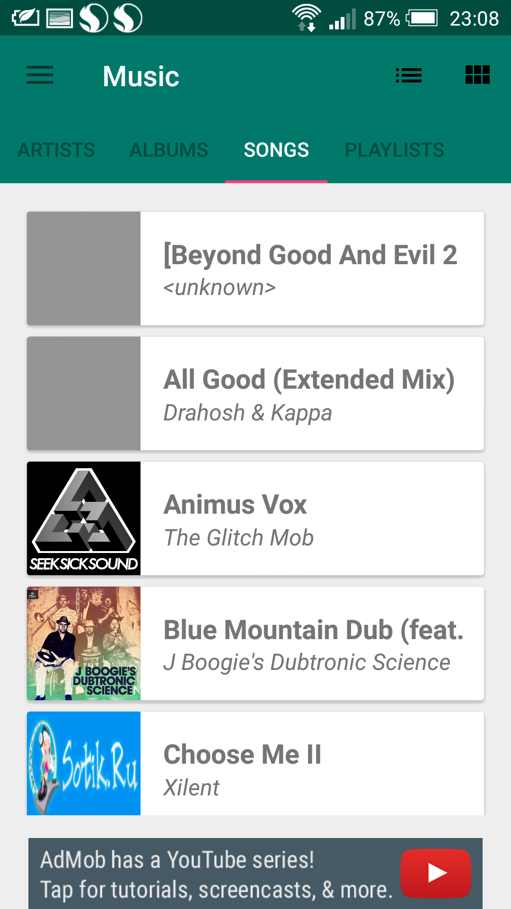
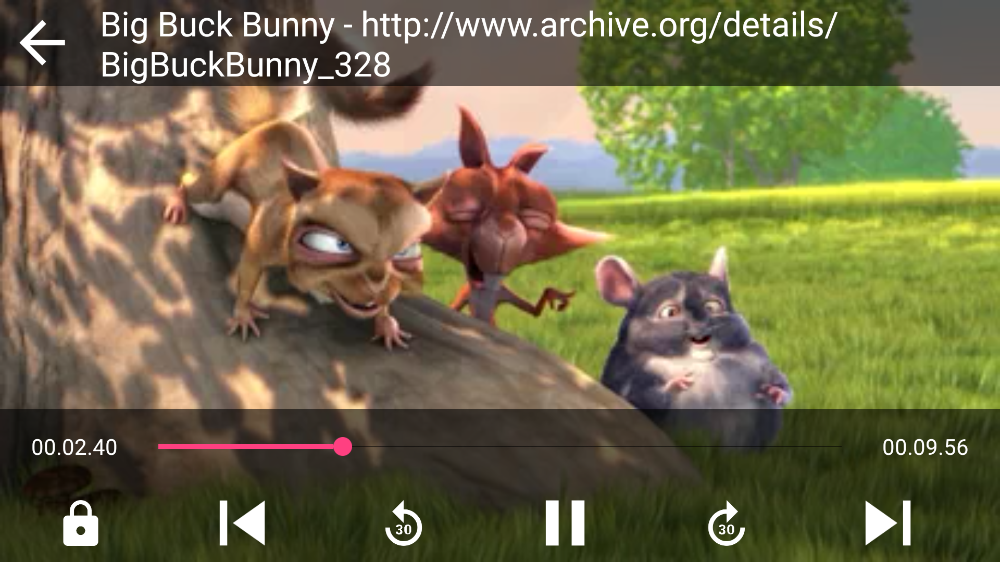

 </img> 

#  UVPlayer

UVPlayer is a free multimedia player for your Android devices which combines an audio and video player playing your local music and videos.
This project was designed, developed and programmed as my bachelor thesis and as the final Capstone Project for [Udacity's Android Developer Nanodegree](https://www.udacity.com/course/android-developer-nanodegree-by-google--nd801).

# GET UVPlayer

I have released UVPlayer in Google Play's alpha channel. You can download APK from this [Google Playstore link](https://plus.google.com/communities/109333228263928350527).

## Interested in the design process?
Click [here](https://github.com/DenisDavidek/UVPlayer/blob/master/docs/Capstone_Stage1.pdf) to see how I designed UVPlayer.

## Features

- Display your audio and video files in a media library.
- Browse your media library in either list or grid visual display.

- Play your music in the background and control it through a nice looking notification.
- Add your music into a favourite playlist.
- Play your videos.

- Support for tablets and smarthphones, auto rotation and a gesture to control brightness.
- Adjust the app's color theme to match your style.

# Used Libraries

1. [Gson](https://github.com/google/gson)
2. [Glide](https://github.com/bumptech/glide)
3. [ExoPlayer](https://github.com/google/ExoPlayer)
4. [Admob](https://github.com/googleads/googleads-mobile-android-examples/tree/master/admob)
5. [Google Analytics](https://github.com/googleanalytics/)

# Screenshots
You can find how UVPlayer looks on different devices below.

## 7-inch Tablets
 </img>  </img> 

## 10-inch Tablets
 </img>  </img> 
 </img>  
 </img>  

## Smartphones
 </img>  </img>  </img>  

 </img>  

# Author
[Denis Dávidek](https://github.com/DenisDavidek)
